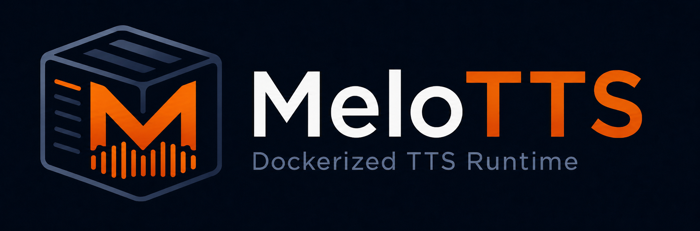

<p></p>

# MeloTTS — Maintained & Easy-to-Use Fork 🛠️

This project is an independently maintained fork of the original [MeloTTS](https://github.com/myshell-ai/MeloTTS) by [Wenliang Zhao](https://github.com/wl-zhao), [Xumin Yu](https://github.com/yuxumin), and [Zengyi Qin](https://github.com/Zengyi-Qin).  
The original work is licensed under the MIT License, and we thank the authors for their excellent research and contributions.

While the original MeloTTS is an impressive research project, this fork focuses on **making it simple to run and integrate** — with a working Docker image, included UI, and API support.

It’s designed so that you can:
- Pull the Docker image
- Run it instantly
- Start synthesizing speech via UI or API without hunting down dependencies

⚠️ **Note:**  This project is maintained for usability and convenience by a single developer (with a different primary tech stack).  
It is **not** a production-hardened system and may require additional work for deployment in critical environments.

✅ **Offline Mode:** Supported — provided that models are baked into the Docker image or mounted via a volume.  
If running in a fully offline environment, ensure all required model files are available locally before starting the container.

🤝 **Contributions Welcome:** If you find bugs, have ideas, or want to improve things, feel free to submit issues or pull requests. Every bit of help makes this project better for everyone.

---

## 🆘 Support & Issues
If you encounter bugs, have feature requests, or need help using MeloTTS:
- Please open a new [GitHub Issue](https://github.com/TheMasterOfDisasters/MeloTTS/issues) with as much detail as possible
- Include error messages, logs, and reproduction steps if applicable
- For general questions or ideas, you can also use the [Discussions](https://github.com/TheMasterOfDisasters/MeloTTS/discussions) tab

---

## 🚀 Quick Start

```bash
docker run -p 8888:8888 --gpus all sensejworld/melotts:latest
```

EN-focused build (smaller target image):

```bash
docker run -p 8888:8888 --gpus all sensejworld/melotts:latest_en
```

Run on a specific GPU (example: GPU index `1`):

```bash
docker run -p 8888:8888 --gpus "device=1" sensejworld/melotts:latest
```

Then open: **[http://localhost:8888](http://localhost:8888)**

---

## 🌐 API Usage Example

```bash
curl -X POST "http://localhost:8888/tts/convert/tts" \
  -H "Content-Type: application/json" \
  -d '{"text":"Hello world!","language":"EN","speaker_id":"EN-BR"}' \
  -o output.wav
```

---

## 📦 Docker Features
- Pinned dependencies for reproducible builds
- Preloaded models for instant offline use (optional)
- GPU acceleration when available
- HTTP API + web UI in one container
- Split image strategy in progress: `*_en` and `*_full` tags

---

## 🐳 Docker Hub
You can explore all available MeloTTS container images on [Docker Hub](https://hub.docker.com/r/sensejworld/melotts/tags).

This is useful if you want to:
- Select a specific version of MeloTTS for compatibility
- Check the latest available builds before pulling
- Verify image tags for deployment

Current tag pattern:
- EN-focused image: `latest_en`, `<version>_en`
- Full multilingual image: `latest`, `<version>_full`

---

## 📜 Version History

### v0.0.8 (planned)
- Scope: runtime-focused cleanup for the Docker UI/API fork.
- Removed unused upstream training surfaces, including training scripts/modules, training example data, legacy script-style package tests, and original upstream docs that no longer matched this fork.
- Trimmed runtime helper code by reducing `melo/utils.py` to inference text preparation, config loading, and `HParams`.
- Removed stale phonemizer generation artifacts and notebook files that were not read by runtime synthesis.
- Cleaned stale imports, unused locals, and unreachable flow-layer code found by lint checks.
- Improved Taskfile API readiness checks by retrying transient startup errors such as `Empty reply from server`.
- Reworked the UI into a Kokoro-style Gradio layout while keeping MeloTTS language, speaker, preset, and advanced synthesis controls.
- Added text metrics, per-language random quotes, voice inventory, synthesis presets, advanced controls, Gradio audio waveform preview, runtime metadata, favicon/brand icon, and richer API documentation links.
- Added `/tts/status`, `/tts/defaults`, `/tts/voices`, `/tts/metrics`, and `/tts/purge` endpoints for the new UI and companion integrations.
- Expanded rapid local iteration tasks so `task localrun`, `task localdev`, and `task localapi` bind-mount `melo/app.py`.
- Added `todo/FEATURE_IDEAS.md` with practical UI/API/runtime improvements that fit the current codebase.
- Documentation: corrected API examples to use `/tts/convert/tts` JSON payloads and documented the current runtime-only scope.

### v0.0.7 (29.03.2026)
- Upgraded Docker runtime/build baseline to Python 3.10 (`python:3.10-slim`) and aligned packaging with `python_requires>=3.10`.
- Reworked app versioning/build metadata:
  - Root `VERSION` file is now the single version source of truth.
  - Build metadata is generated at image build time (no hardcoded `BUILD_ID`) and exposed in UI/API.
- Upgraded web stack to newer compatible releases: `gradio==4.44.1`, `gradio-client==1.3.0`, `fastapi==0.115.12`, `starlette==0.46.2`, `typer==0.12.5`.
- Applied large dependency/security refresh with pinned versions for reproducible builds, including network/security-sensitive packages such as `requests==2.32.4`, `urllib3==2.3.0`, `certifi==2025.6.15`, plus broad runtime library updates.
- Added/kept compatibility guardrails for stability:
  - `markupsafe` remains on 2.x for Gradio compatibility.
  - `huggingface-hub==0.21.4` and `filelock==3.13.1` remain constrained by `cached-path==1.6.2`.
- Improved offline reliability and startup resilience:
  - Build-time preload profiles (`EN_ONLY` / `FULL`) with retry + strict/non-strict controls.
  - NLTK resources required for EN synthesis (including `averaged_perceptron_tagger_eng` and `cmudict`) are preloaded during image build for offline-ready runs.
- Fixed Gradio 4.x UI regressions after upgrades (language/speaker loading + synth output compatibility) while keeping API behavior stable.
- Split Docker release flow into EN and FULL image tracks/workflows (`<version>_en`, `<version>_full`) to improve build/release flexibility.
- Run with:
  ```bash
  docker run -p 8888:8888 --gpus all sensejworld/melotts:v0.0.7_en
  docker run -p 8888:8888 --gpus all sensejworld/melotts:v0.0.7_full
  docker run -p 8888:8888 --gpus "device=1" sensejworld/melotts:v0.0.7_en
  ```

### v0.0.6 (27.03.2026)
- Model loading is now much faster (from ~30 seconds down to only a few seconds in testing).
- Added working RTX 50-series (`sm_120`) support in the Docker setup.
- Added GPU selection support for Docker runs, so you can choose which GPU to use.
- Improved build resilience for model preloading during Docker image creation.
- Run with:
  ```bash
  docker run -p 8888:8888 --gpus all sensejworld/melotts:v0.0.6
  ```

### v0.0.5 (27.03.2026)
- Added more English model options (including V2 and V3 variants).
- Added UI tabs for `UI Playground` and `API Docs`.
- Added build/version badge in UI (top-right) via `APP_VERSION` and `BUILD_ID`.
- Added memory management in UI (`Purge others`) to release non-selected language models.
- Improved API documentation visibility directly inside the app (`/` -> API Docs tab + `/tts/docs`).
- Updated release planning: V2/V3 scope completed; deferred separate base-repo split plan.
- Run with:
  ```bash
  docker run -p 8888:8888 --gpus all sensejworld/melotts:v0.0.5
  ```

### v0.0.4 (09.08.2025)
- **Dependency updates** for improved performance and stability.
- **Full offline support** — all required models are now baked into the image.
- **Model overwrite option**: set `MELOTTTS_MODELS` to point to your custom model folder.
- **Smaller image size** via optimized multi-stage Docker build.
- Run with:
  ```bash
  docker run -p 8888:8888 --gpus all sensejworld/melotts:v0.0.4

### v0.0.3 (25.07.2025)
- Optimized docker build to use layer caching so we can build stuff fast after the initial build
- Expanded ping to include version and build
- Expanded UI with sdp_ratio, noise_scale and noise_scale_w
- Expanded API with sdp_ratio, noise_scale and noise_scale_w
- Corrected faulty version dates
- Updated documentation
- Run with:
  ```bash
  docker run -p 8888:8888 --gpus all sensejworld/melotts:v0.0.3`

### v0.0.2 (22.06.2025)
- Enable API calls together with UI
- run with
  ```bash 
  docker run -p 8888:8888 --gpus all sensejworld/melotts:v0.0.2`
- run for english only
    ```bash 
    docker run -p 8888:8888 -e TTS_LANGUAGES=EN sensejworld/melotts:v0.0.2`
- run for english and japanese
    ```bash 
    docker run -p 8888:8888 -e TTS_LANGUAGES=EN,JP sensejworld/melotts:v0.0.2`
- run for english with gpu support named melotts_gpu_en
    ```bash 
    docker run -p 8888:8888 --gpus all -e TTS_LANGUAGES=EN --name melotts_gpu_en sensejworld/melotts:v0.0.2`

### v0.0.1 (21.06.2025)
- Initial release
- Basic TTS functionality
- Support for English (Default, US, BR, India, AU)
- Docker support for both CPU and GPU
- Web interface on port 8888 (http://localhost:8888/)
- Run with
  ```bash 
  docker pull sensejworld/melotts:v0.0.1`

---

## 🛠 Developer Notes
If you’re interested in building MeloTTS locally, testing changes, or working directly on the codebase, I have included additional technical details and tips in [`notes.md`](./docs/notes.md).

This file contains guidance for:
- Local environment setup
- Dependency management
- Testing workflows
- Build & Docker optimization notes

---

## 📜 License

This fork is licensed under the [MIT License](LICENSE).  
Original work by Wenliang Zhao, Xumin Yu, and Zengyi Qin in [MeloTTS](https://github.com/myshell-ai/MeloTTS).
